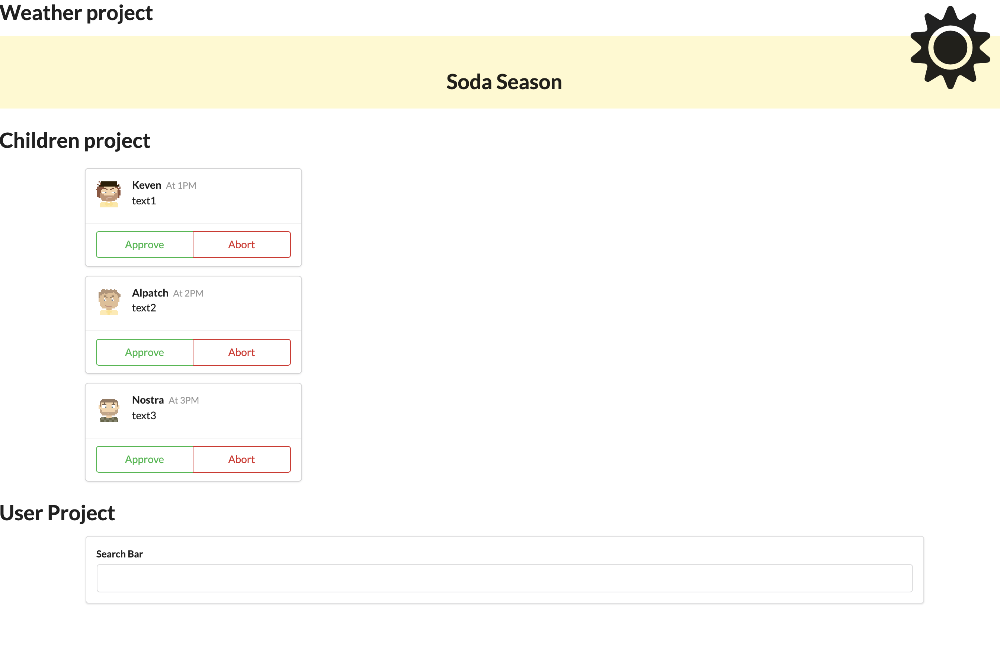

## JSX Project

### JSX Folder classe based



- JSX is not HTML, but with Babel to be converted to ES6

- style={{ color: 'red' }} in JSX and style="color:#000" in ES6

> www.babeljs.io

> https://reactjs.org/docs/introducing-jsx.html

VS Code - JSX

```
const App = () => {
 return (
     <h1>Hello World</h1>
 );
};
```

Converted - ES6

```
const App = () => {
 return /*#__PURE__*/React.createElement("h1", null, "Hello World");
};
```

#### In a class that include a constructor() {}

- If not extending, do not need super()

#### Fetch + Axios

- Fetch: Build-in Browser. Basic tool, but it's easy

- Axios: npm install axios. Complete tool

#### NPM vs NPX

- NPX is for newer version of Node and should use to execute.

- NPM to install and support all versions

#### Common state issue

- Unhandled Rejection (TypeError): this.setState is not a function
- Solution: use an arrow function

#### Class vs Function Component

Component: To show to the user, specific code in a specific time and hooks, state system to update content on screen. Older ract user component since it was the one with state.

Function: To show to the user, use hooks to run code at a time, Hooks to access state and update screen

##### Component Lifecycle (Most popular)

They will be call automatically by React

```
import React, { Component } from "react";

export default class SongPlayer extends Component
```

Or

```
import React from "react";

export default class SongPlayer extends React.Component
```

##### 1 - constructor

##### 2 - render (Must be there - always)

- (content while on screen - JSX usually)

##### 3 - componentDidMount() {} is call one time after the render is done

- (pending and wait to receive an update)

##### 4 - componentDidUpdate

- (pending and wait until the componenet is not shown)

##### 5 - componentWillUnmount -> We need to remove the component from the interface - clean up

### Hooks Folder function based

#### useState - Hooks

Will run at initial, every rerender if data has changed

```
  useEffect(() => {}, [term]);
```

Will run at initial

```
  useEffect(() => {}, []);
```

Will run at initial, every rerender

```
  useEffect(() => {});
```

#### Callback

```
(async () => {
      await axios.get("https://api.agify.io/?name=bella");
    })();
```

- OR
  ```
  axios.get("https://api.agify.io/?name=memma").then((res) => {
    console.log(res.data);
  });
  ```

#### Redux

  <Provider store="createStore(reducers)">
    <App />
  </Provider>,

#### Export

- import aaa if export default aaa

- import { bbb } if export bbb
